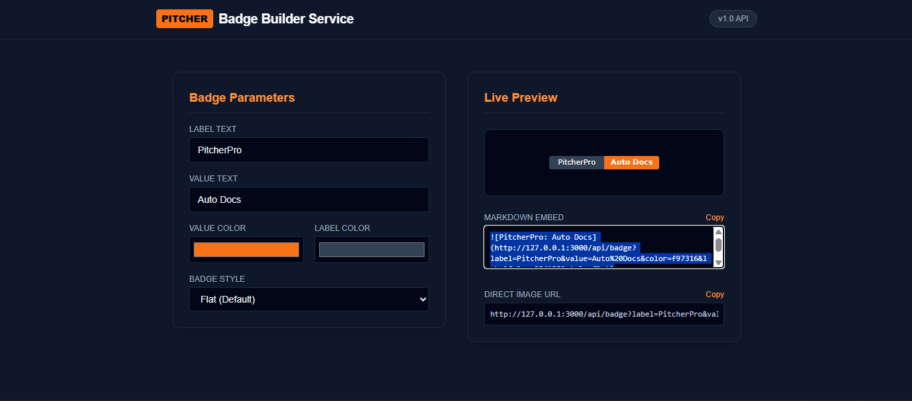

<!-- PITCHER_START -->

# pitcherProBadges

  

    

---

## Overview

**pitcherProBadges** is a **REST API Backend** built using **Node.js, Express, HTML, JavaScript**. The codebase comprises **8 source files** totaling **172 lines of code**.

**Key Highlights:**
- Backend API & server side processing core

---

## Preview

<br>
<sub>*Preview*</sub>

---

## Technology Stack

- Node.js
- Express
- HTML
- JavaScript
- Environment Variables

---

## Folder Structure

```text
pitcherProBadges/
├── assets
│   └── preview.png (38.8 KB)
├── public
│   └── index.html (5.6 KB)
├── .env (0 B)
├── .gitIgnore (63 B)
├── package-lock.json (30.5 KB)
├── package.json (287 B)
├── README.md (2.2 KB)
└── server.js (3.1 KB)
